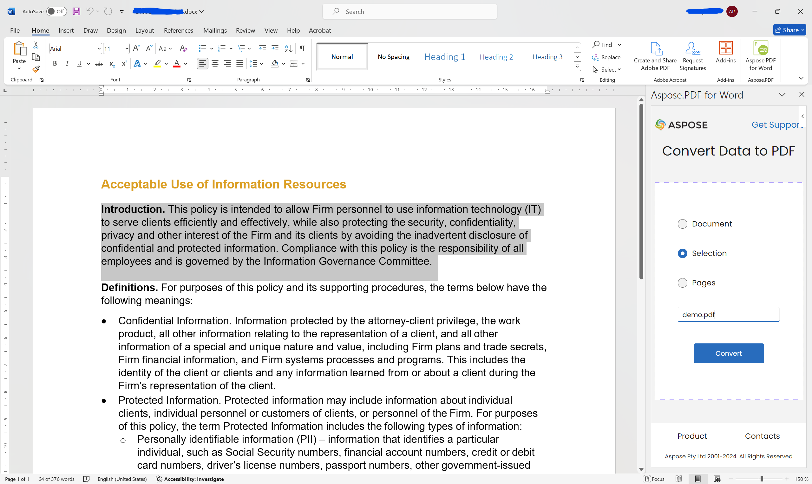

# Aspose.PDF for Excel and Aspose.PDF for Word Add-ins

Export Excel workbooks, sheets & ranges into editable PDFs with our Excel Add-in. Or create editable PDFs from Word documents, pages & selections with our Word Add-in.

Our PDF exporter tools is intended for users and system administrators who want more flexibility when working with PDFs.

Work on your documents within the Excel or Word application, then use the Aspose.PDF Add-in to convert these spreadsheets and Word documents into PDFs in seconds.
You can also compress your file before conversion to ensure your PDF is in an optimal file size for easy shareability.

## 📓 Features

When these add-ins are used, you can:

- Convert your XLSX or DOCX files into PDFs in seconds.
- Convert selected ranges, pages or worksheets into PDFs.

## 🛠 How to install

1. Go to the [Releases](https://github.com/aspose-pdf/aspose-pdf-for-excel-addin/releases) folder.
2. Download the latest version.
3. Run the downloaded file and follow the on-screen instructions to install the add-in.

## 🚀 Activatiton

**Warning!** The current add-in version supports the desktop versions of Excel and Word.

**Important!** If you installed an add-in with an option "Install add-in for local instance of Office", refer to the [Create Trusted Add-in Catalogs using Shared folders / Windows 11](#create-trusted-add-in-catalogs-using-shared-folders--windows-11) section.

### Activate the add-in:

1. Select `Home > Add-ins` from the Excel or Word ribbon, then select `Get Add-ins`.
2. Choose `SHARED FOLDER` at the top of the Office Add-ins dialog box.
      
3. Select the Aspose.PDF for Excel or Aspose.PDF for Word add-in and choose `Add to insert the add-in`.
4. Verify that your add-in is installed. The new button Aspose.PDF for Excel (Aspose.PDF for Word) should appear on the Home ribbon.
5. For more information regarding add-in installation in Excel and Word software on Windows, please refer to [Sideload Office Add-ins](https://learn.microsoft.com/en-us/office/dev/add-ins/testing/create-a-network-shared-folder-catalog-for-task-pane-and-content-add-ins#share-a-folder) for testing from a network share.

### Create Trusted Add-in Catalogs using Shared folders / Windows 11

1. Share a folder:
    1. In `File Explorer`, go to the parent folder, or drive letter, of the folder you want to use as your shared folder catalog.
    2. Open the context menu for the folder you want to use as your shared folder catalog (for example, right-click the folder) and choose `Properties`.
    3. In the `Properties` dialog window, open the `Sharing` tab and choose the `Share` button.
    4. Within the `Network access` dialog window, add yourself and any other users and/or groups with whom you want to share your add-in. The folder must have at least `Read/Write` permission. After choosing people to share with, choose the `Share` button.
    5. When you see the `Your folder is shared` confirmation, note the full network path displayed immediately following the folder name. (You'll need to enter this value as the Catalog Url when you specify the shared folder as a trusted catalog, as described in the next section of this article.) Choose the `Done` button to close the `Network Access` dialog window.
    6. Choose the `Close` button to close the `Properties` dialog window.
    7. Put the manifest XML file (the one you have edited and saved) into the shared folder.

2. Specify the shared folder as a trusted catalog:
    1. Open a new document in Excel.
    2. Choose the `File` tab, and then choose `Options`.
    3. Choose `Trust Center` and then the `Trust Center Settings` button.
      
    4. Choose `Trusted Add-in Catalogs`.
    5. In the `Catalog Url` box, enter the full network path to the folder that you shared previously. If you failed to note the folder's full network path when you shared the folder, you can get it from the folder's Properties dialog window.
    6. After entering the folder's full network path into the `Catalog Url` box, choose the `Add catalog button`.
    7. Select the `Show in Menu` check box for the newly added item, and then click the `OK` button to close the Trust Center dialog window.
      
    8. Choose the `OK` button to close the `Options` dialog window.
    9. Close and reopen the Excel application so your changes will occur.

## Support

- 🙏 [Aspose.PDF for .NET Free Support Forum](https://forum.aspose.com/c/pdf/10)
- 💡 [Aspose.PDF for .NET Paid Support Helpdesk](https://helpdesk.aspose.com/)
